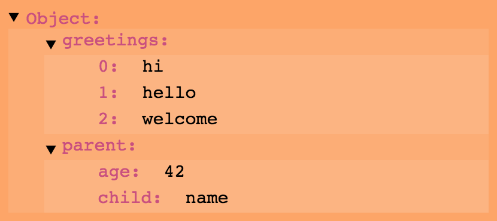

# Angular JSON Tree

This plugin was created to address a common development issue: how to easily visualize JSON/JS Object trees. From a development standpoint, when querying API endpoints and wishing to easily visualize the response object—or from a design standpoint, when looking for an easy way to display a complex object—this plugin provides an easy to use directive for displaying the Object tree response.

This is nice and easy because all you should have to do is include the directive in your app, and then pass a reference to the directive of which object on the scope you want it to display.

A live implementation of this directive can be found at [http://blog.alexwendland.com/angular-json-tree/](http://blog.alexwendland.com/angular-json-tree/) and the source for that project can be found on the [gh-pages branch](https://github.com/awendland/angular-json-tree/tree/gh-pages).

**Requirements:** AngularJS 1.2+

**File Size (js + css):** 3.40Kb minified, 1.46Kb gzipped

## Usage:

1. Include `angular-json-tree` as a dependency for your app
```javascript
angular.module('myApp', ['angular-json-tree'])
```
2. Include the supplied CSS file (or create your own).
3. Setup the directive and reference an object on your scope

JavaScript:

```javascript
$scope.someobj = {
    greetings: ["hi", "hello", "welcome"],
    parent: {
        child: "name",
        age: 42
    }
};
```

HTML:

```html
<json-tree object="someobj"></json-tree>
```

### via bower:
```
$ bower install angular-json-tree
```

## Why I created this:

I was searching for a way to easily display the JSON results from an API endpoint. The objects were dynamic and followed no uniform pattern. Thus I created this AngularJS directive. Given the above input (from Usage), it would produce an expandable object similar to:



This directive helps me with another problem while developing: visualizing JSON objects. Being able to break down JSON objects piece by piece has proven invaluably useful. To simplify that process, I threw together this website: [http://blog.alexwendland.com/angular-json-tree/](http://blog.alexwendland.com/angular-json-tree/).

## Directive Configuration:
These attributes are available for configuration on the directive:

### object [required]

The object property takes the name of an object on the $scope. This object will be displayed as an expandable tree.

```html
<json-tree object="someobj"></json-tree>
```

### start-expanded [optional, default=false]

This is an optional attribute that designates if the tree's root should display as expanded initially. This is useful when you are only showing one json-tree, but would probably be set to false if json-trees were being created with an ng-repeat loop.

```html
<json-tree object="someobj" start-expanded="true"></json-tree>
```

### root-name [optional, default='Object']

This is an optional attribute that sets the title displayed at the root node. This is useful when you are showing sub-portions of an object or want the object root node to have a different string than 'Object'.

```html
<json-tree object="someobj" root-name="'Name'"></json-tree>
```

## Styling

The default CSS is separated into two parts: structure and looks. The looks section can be easily modified in order to change font, color and toggle buttons. The structure section can also be modified, but some more care will be needed because it provides the framework from which this directive provides functionality. The looks framework will be covered here while the structure framework will only be touched on.

The json-tree is based on recursive nodes of two basic structures. The first structure is for nodes that have no subnodes themselves (a leaf), and the other is for nodes that have children (a branch). Here the simplified template structures for each, with appropriate, style-able, class names.

### Leaf Nodes

```html
<json-node class="not-expandable">
    <span class="key">{{key}}</span>
    <span class="leaf-value">{{value}}</span>
</json-node>
```
In the default CSS, all `.key` elements have the same style, a bold red color. There is some padding, and then the property's value follows. By default, no special styling is applied to `.lead-value` elements.

### Branch Nodes

Branch nodes have two states: expanded or not-expanded. The not-expanded state is very similar to the leaf nodes and simply exchanges the `.leaf-value` class for `.branch-preview`.

```html
<json-node class="not-expandable">
    <span class="key">{{key}}</span>
    <span class="branch-preview">{{value}}</span>
</json-node>
```
In the default CSS, `.branch-preview` elements are italicized, concatenated, hidden overflow, and reduced in opacity.

The expanded state is different and contains further subnodes that are generated with ng-repeat:

```html
<json-node class="expandable">
    <span class="key">{{key}}</span>
    <ul class="branch-value">
        <li ng-repeat>
            <json-node>{{subnode values}}</json-node>
        </li>
    </ul>
</json-node>
```
The `.expandable` class adds several features to the normal `json-node` element. Particularly, by the default looks CSS, a carrot-style toggle pseudo-element will be created. This `::before` element will rotate 90 deg downward when the element is expanded.

Additionally, `json-node` elements receive a class corresponding to their object type. For example, the `.array` class or `.object` may be placed on a `json-node`. These classes can be used for special stylings.

## Further Explanation:

An example implementation of this project can be found at the [gh-pages branch](https://github.com/awendland/angular-json-tree/tree/gh-pages) of this repository.

## Changelog

#### v1.0.0
  * Update *npm* dev dependencies to latest (as of 2016-05-24) and remove unnecessary ones
  * Update *angular* dependency to accept all 1.x versions
  * Set `main` in bower.json and package.json properly so that this package can easily be included in *bower* and *npm* managed projects ([Issue #7](https://github.com/awendland/angular-json-tree/issues/7), [PR #1](https://github.com/awendland/angular-json-tree/pull/1))
  * Allow setting the name of the root node ([Issue #5](https://github.com/awendland/angular-json-tree/issues/5))
    * This can be done setting the `root-name` attribute on the directive. An evaluatable expression must be provided, such as `root-name="'My name'"`.

#### v0.0.1
  * Initial release

## Credits:

Thank you to [Mark Lagendijk](https://stackoverflow.com/users/665825/mark-lagendijk) from StackOverflow for providing a service than assists in recursive directives. That post can be found [here](http://stackoverflow.com/questions/14430655/recursion-in-angular-directives).

Also, thank you to [chieffancypants](https://github.com/chieffancypants/) for his [angular-loading-bar](https://github.com/chieffancypants/angular-loading-bar) project from which I used the README.md as inspiration for this (poor) one.

## License:

Licensed under the Creative Commons Attribution 4.0 International (CC-BY-4.0)
